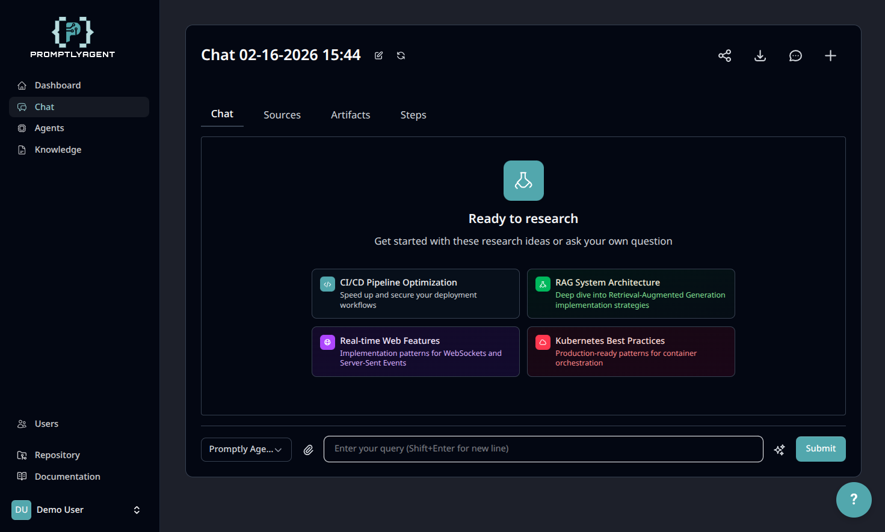

# PromptlyAgent

**AI-Powered Research and Knowledge Management Framework**

PromptlyAgent is a Laravel-based framework that combines multi-agent AI orchestration with advanced knowledge management capabilities. It features real-time streaming responses, RAG (Retrieval-Augmented Generation) pipelines, and a powerful extensible package system for building custom AI applications.

[](https://laravel.com)
[](https://www.php.net)
[](https://livewire.laravel.com)
[](https://tailwindcss.com)

---

## 📸 Screenshots



**[View More Screenshots →](screenshots/README.md)** - Explore the full feature set including agent management, knowledge system, artifacts, PWA, and more.

---

## ✨ Features

### 🤖 Multi-Agent AI System
- **Configurable AI Agents**: Create custom agents with specific tools, knowledge sources, and behaviors
- **Multi-Provider Support**: Leverage OpenAI, Anthropic, Google, and AWS Bedrock through Prism-PHP
- **Tool Ecosystem**: Extensible tool system allowing agents to interact with external services
- **Workflow Orchestration**: Chain multiple agents for complex research tasks
- **Real-time Streaming**: Live response streaming using Laravel Reverb WebSockets

### 🧠 Advanced Knowledge Management
- **Hybrid Search**: Combines vector embeddings with keyword search using Meilisearch
- **RAG Pipeline**: Context-aware responses using your own documents and data
- **Multiple Source Types**: Support for PDFs, web pages, text documents, and external integrations
- **Auto-refresh**: Scheduled updates for external knowledge sources
- **Privacy Controls**: Flexible privacy levels (private, team, public) with user-level access control
- **Tagging System**: Organize and categorize knowledge documents

### 🔌 Extensible Package Framework
- **Self-Registering Packages**: Zero-core-changes architecture for extending capabilities
- **Complete Extension Points**: Agent tools, knowledge sources, input triggers, output actions
- **OAuth Support**: Pre-built OAuth flows for third-party services
- **Current Integrations**:
  - **Notion**: OAuth, agent tools, knowledge sources, output actions
  - **Slack**: Webhooks, OAuth, input triggers, messaging output actions
  - **HTTP Webhooks**: Generic webhook input triggers for automation
  - **Schedule**: Cron-based scheduled task input triggers

### 🎨 Modern User Interface
- **TALL Stack**: Tailwind CSS 4, Alpine.js, Laravel, Livewire 3
- **Flux UI Components**: Beautiful, accessible component library
- **Dark Mode**: Full dark mode support with custom theme system
- **Real-time Updates**: Instant UI updates without page refreshes
- **FilamentPHP Admin**: Professional admin panel for data management

### 💡 Interactive AI Help System
- **Context-Aware Assistance**: AI-powered help system with knowledge of your current codebase
- **Evergreen Content**: Help content that stays current with your code through RAG
- **Intelligent Search**: Natural language queries against project documentation and code
- **Customizable**: Extendable knowledge base for project-specific guidance

### ⚡ Performance & Scalability
- **Queue System**: Horizon-powered background job processing
- **Caching**: Multi-layer caching with Redis
- **Optimized Search**: Meilisearch for sub-millisecond search results
- **Lazy Loading**: Efficient data loading patterns
- **Docker-Ready**: Laravel Sail for consistent development environments

---

## 🏗️ Architecture

PromptlyAgent is built with a modular architecture designed for scalability and extensibility.

📚 **Technology Stack**: See the [Introduction Guide](https://github.com/promptlyagentai/promptlyagent/blob/main/docs/00-introduction.md#technology-stack) for complete details

📚 **Architecture Details**: See the [Architecture Guide](https://github.com/promptlyagentai/promptlyagent/blob/main/docs/03-architecture.md) for system design and component diagrams

---

## 🚀 Quick Start

> **⚡ Important**: PromptlyAgent runs entirely in Docker containers using Laravel Sail. You don't need PHP, Composer, or Node.js installed on your local machine—Docker handles everything!

### Prerequisites

Before you begin, ensure you have:

✅ **Docker Desktop** (Mac/Windows) or **Docker Engine + Docker Compose** (Linux)
✅ **Git** for cloning the repository
✅ **AI Provider API Key** - At least one of:
   - [OpenAI API Key](https://platform.openai.com/api-keys) (GPT models)
   - [Anthropic API Key](https://console.anthropic.com/) (Claude models)
   - [Google AI API Key](https://makersuite.google.com/app/apikey) (Gemini models)
   - [AWS Credentials](https://aws.amazon.com/bedrock/) (Bedrock models)

> **🔒 Security Note**: Admin users must be created via CLI (`php artisan make:admin`) for security. Web-based setup has been removed to eliminate default credential vulnerabilities.

### Installation

```bash
# 1. Clone and navigate
git clone https://github.com/promptlyagentai/promptlyagent.git
cd promptlyagent

# 2. Configure environment
cp .env.example .env
# Edit .env and set:
# - Your AI provider API key (OpenAI, Anthropic, Google, or AWS)
# - WWWUSER=$(id -u) and WWWGROUP=$(id -g) to match your host user for proper file permissions

# 3. Install Composer dependencies (first-time setup)
docker run --rm \
    -u "$(id -u):$(id -g)" \
    -v "$(pwd):/var/www/html:z" \
    -w /var/www/html \
    laravelsail/php84-composer:latest \
    composer install --ignore-platform-reqs --no-scripts

# 4. Start Docker containers
./vendor/bin/sail up -d
# Note: The initial build can take 10-15 minutes depending on hardware
# Subsequent starts are much faster using cached images

# 5. Complete Composer setup (runs post-install scripts)
./vendor/bin/sail composer install

# 6. Install npm dependencies
./vendor/bin/sail npm install

# 7. Initialize application
./vendor/bin/sail artisan key:generate
./vendor/bin/sail artisan migrate

# 8. Create admin user
./vendor/bin/sail artisan make:admin

# 9. Seed database (creates default agents)
./vendor/bin/sail artisan db:seed

# 10. Build frontend
./vendor/bin/sail npm run build

# 11. Access the application
# Open http://localhost in your browser
# Horizon Dashboard: http://localhost/horizon
```

📚 **For troubleshooting, advanced configuration, and detailed explanations**: See the [Complete Installation Guide](https://promptlyagent.ai/docs/index.html#getting-started) or [GitHub docs](https://github.com/promptlyagentai/promptlyagent/blob/main/docs/01-getting-started.md)

### What's Next?

After installation, you can:

1. **Create your first agent** - See "Creating Your First Agent" section below
2. **Import knowledge** - Upload documents to power RAG-based responses
3. **Explore integrations** - Connect Notion, Slack, or build custom integrations
4. **Review documentation** - Check out `docs/` for detailed guides

**Need help?** See the [Troubleshooting](#-troubleshooting) section below.

### Creating Your First Agent

1. **Login** at http://localhost with your admin credentials
2. **Navigate to Agents** in the sidebar
3. **Click "Create Agent"**
4. **Configure your agent**:
   - Name: Give it a descriptive name
   - Model Provider: Choose your AI provider (e.g., OpenAI)
   - Model: Select specific model (e.g., gpt-4)
   - System Prompt: Define agent behavior and personality
   - Tools: Select tools the agent can use
   - Knowledge: Attach relevant knowledge sources
5. **Save and Test** your agent in the chat interface

---

## 🛠️ Development

### Essential Commands

All commands use Laravel Sail (Docker):

```bash
# Start development environment
./vendor/bin/sail up -d

# Frontend development (hot reload)
./vendor/bin/sail npm run dev

# Run tests
./vendor/bin/sail artisan test

# Format code
./vendor/bin/sail pint

# Queue management
./vendor/bin/sail artisan horizon              # Start queue worker
./vendor/bin/sail artisan horizon:status       # Check status
./vendor/bin/sail artisan horizon:pause        # Pause queue
./vendor/bin/sail artisan horizon:continue     # Resume queue

# Knowledge management
./vendor/bin/sail artisan knowledge:reindex          # Rebuild search index
./vendor/bin/sail artisan knowledge:cleanup-index    # Remove stale docs
./vendor/bin/sail artisan knowledge:refresh-external # Refresh external sources

# Database operations
./vendor/bin/sail artisan migrate                    # Run migrations
./vendor/bin/sail artisan db:seed                    # Seed database with demo data
./vendor/bin/sail artisan tinker                     # Interactive console

# Log viewing
./vendor/bin/sail artisan pail                       # Real-time log viewer
```

### Project Structure

```
promptlyagent/
├── app/
│   ├── Filament/              # Admin panel resources
│   ├── Livewire/              # User-facing components
│   ├── Models/                # Eloquent models
│   ├── Services/
│   │   ├── Agents/            # Agent execution & tools
│   │   └── Knowledge/         # RAG & document processing
│   └── Tools/                 # Global Prism tools
├── database/
│   ├── migrations/            # Database schema (consolidated migrations)
│   └── seeders/               # Database seeders
├── docs/
│   ├── 06-theming.md          # Theme & color documentation
│   └── 07-package-development.md  # Integration development
├── patches/                   # Vendor package fixes
├── resources/
│   ├── views/                 # Blade templates
│   └── css/                   # Tailwind & theme system
├── routes/
│   ├── web.php                # Web routes
│   └── console.php            # Console commands
└── tests/
    ├── Feature/               # Feature tests (primary)
    └── Unit/                  # Unit tests
```

### Running Tests

```bash
# All tests
./vendor/bin/sail artisan test

# Specific test file
./vendor/bin/sail artisan test tests/Feature/Agents/AgentExecutionTest.php

# Filtered by name
./vendor/bin/sail artisan test --filter=agent_can_execute

# With coverage
./vendor/bin/sail artisan test --coverage

# Parallel execution
./vendor/bin/sail artisan test --parallel
```

### Code Quality

```bash
# Format code with Laravel Pint
./vendor/bin/sail pint

# Check formatting without changes
./vendor/bin/sail pint --test
```

---

## 🔌 Extensibility

### Package System Overview

PromptlyAgent is built as an **extensible framework** using a self-registering package system that requires **zero changes to core code**. Packages can extend the framework's capabilities in multiple ways:

**What Packages Can Provide:**

1. **Agent Tools** - Custom tools that agents can use to interact with external services
2. **Knowledge Sources** - Integration with external data sources for RAG pipeline
3. **Input Triggers** - Automated workflows triggered by external events (webhooks, schedules)
4. **Output Actions** - Process agent results (send to Slack, save to Notion, etc.)
5. **OAuth Providers** - Authentication flows for third-party services
6. **UI Components** - Livewire components for custom interfaces

**Architecture Benefits:**
- **Zero Core Changes**: Add integrations without modifying the main application
- **Auto-Discovery**: Laravel automatically discovers and registers packages
- **Isolated Testing**: Each package is independently testable
- **Version Control**: Packages can be versioned and distributed separately

### Creating Custom Integrations

1. **Create package directory**
   ```bash
   mkdir -p packages/my-integration/src
   ```

2. **Create package files**
   - `composer.json` - Package definition with auto-discovery
   - `src/MyIntegrationServiceProvider.php` - Laravel service provider
   - `src/Tools/` - Agent tools (optional)
   - `src/InputTriggers/` - Input triggers (optional)
   - `src/OutputActions/` - Output actions (optional)
   - `src/Providers/` - OAuth providers (optional)
   - `src/Services/` - Business logic
   - `src/Livewire/` - UI components (optional)

3. **Register in main composer.json**
   ```json
   {
       "repositories": [
           {"type": "path", "url": "./packages/my-integration"}
       ],
       "require": {
           "promptlyagentai/my-integration": "@dev"
       }
   }
   ```

4. **Install package**
   ```bash
   ./vendor/bin/sail composer update promptlyagentai/my-integration
   ```

**Example Packages:**
- **notion-integration**: OAuth, agent tools, knowledge source, output actions
- **slack-integration**: Webhooks, OAuth, input triggers, output actions
- **http-webhook-integration**: Generic webhook input triggers
- **schedule-integration**: Scheduled task input triggers

**Complete guides**:
- `docs/07-package-development.md` - Comprehensive tutorial with examples

### Creating Custom Agent Tools

Tools extend agent capabilities. Example tool:

```php
<?php

namespace App\Tools;

use Prism\Prism\Facades\Tool;

class WeatherTool
{
    public static function register(): void
    {
        Tool::as('get_weather')
            ->for('anthropic')
            ->withDescription('Get current weather for a location')
            ->withStringParameter('location', 'City name or coordinates')
            ->using(function (string $location): string {
                // Your tool logic here
                $weather = self::fetchWeather($location);
                return json_encode(['weather' => $weather]);
            });
    }

    private static function fetchWeather(string $location): string
    {
        // Implementation
        return "Sunny, 72°F";
    }
}
```

See CLAUDE.md for complete tool development patterns.

### Custom Themes

The color system supports custom themes:

1. **Create theme file** in `resources/css/themes/`
2. **Define color palettes** (50-950 shades)
3. **Import in** `resources/css/app.css`
4. **Rebuild CSS** with `./vendor/bin/sail npm run build`

See `docs/06-theming.md` for complete documentation.

---

## 📖 Documentation

### Getting Started
- **[README.md](README.md)** (this file) - Overview and quick start
- **[CONTRIBUTING.md](CONTRIBUTING.md)** - Contribution guidelines and workflow

### Development Guides
- **[Theming System](docs/06-theming.md)** - Theme customization and semantic tokens
- **[Package Development Guide](docs/07-package-development.md)** - Create custom integrations
- **[CLAUDE.md](CLAUDE.md)** - AI assistant development guidelines

### Reference
- **[API Documentation](http://localhost/docs)** - Interactive API docs (after installation)

---

## 🌍 Community & Resources

Explore the broader PromptlyAgent ecosystem:

- **[Community](https://promptlyagent.ai/community)** - Browse extensions, share integrations, and see what others are building
- **[Documentation](https://promptlyagent.ai/docs/index.html)** - Basic setup guides and API documentation
- **[Roadmap](https://promptlyagent.ai/roadmap)** - Upcoming features and project direction

For detailed development documentation, see the `docs/` directory in this repository.

---

## 🧪 Testing

The project uses **Pest 3** for testing with a focus on feature tests:

```php
// Example: tests/Feature/Agents/AgentExecutionTest.php

it('executes agent with tools', function () {
    $user = User::factory()->create();
    $agent = Agent::factory()
        ->for($user)
        ->hasAttached(Tool::factory()->count(2))
        ->create();

    $execution = AgentExecution::factory()
        ->for($agent)
        ->for($user)
        ->create();

    expect($execution->status)->toBe('pending');

    $result = $this->actingAs($user)
        ->post("/api/agents/{$agent->id}/execute", [
            'query' => 'Test query'
        ]);

    $result->assertSuccessful();
    expect($execution->fresh()->status)->toBe('completed');
});
```

---

## 🛠️ Troubleshooting

### Common Issues

**Problem: Docker containers fail to start**
```bash
# Solution: Check if ports are already in use
docker ps -a
# Stop conflicting containers or change ports in docker-compose.yml
```

**Problem: "Vite manifest not found" error**
```bash
# Solution: Build frontend assets
./vendor/bin/sail npm run build
# OR for development with hot reload
./vendor/bin/sail npm run dev
```

**Problem: Queue jobs not processing**
```bash
# Solution: Ensure Horizon is running
./vendor/bin/sail artisan horizon:status
# If not running, start it
./vendor/bin/sail artisan horizon
```

**Problem: Agent execution fails with "No API key" error**
```bash
# Solution: Verify .env file has correct API keys
./vendor/bin/sail artisan tinker
>>> config('services.openai.api_key')  # Should return your key
```

**Problem: Knowledge search returns no results**
```bash
# Solution: Rebuild Meilisearch index
./vendor/bin/sail artisan knowledge:reindex
```

**Problem: Permission denied errors in Docker**
```bash
# Solution: Fix file ownership
sudo chown -R $USER:$USER .
```

**Problem: Database connection refused**
```bash
# Solution: Ensure MySQL container is running
./vendor/bin/sail ps
# If not running, start containers
./vendor/bin/sail up -d
```

### Getting Help

If you encounter issues not listed here:

1. **Check logs**: `./vendor/bin/sail artisan pail` for real-time logs
2. **Review documentation** in `docs/` directory
3. **Search existing issues** on GitHub
4. **Open a new issue** with details (see [CONTRIBUTING.md](CONTRIBUTING.md))

---

## 🤝 Contributing

We welcome contributions! Please read our [**CONTRIBUTING.md**](CONTRIBUTING.md) guide for:

- Development setup and workflow
- Code style and conventions
- Testing requirements
- Pull request process
- Commit message format

**Quick Start for Contributors:**

1. Fork and clone the repository
2. Follow the [Installation](#installation) steps
3. Create a feature branch (`git checkout -b feature/amazing-feature`)
4. Make your changes and add tests
5. Format code: `./vendor/bin/sail pint`
6. Run tests: `./vendor/bin/sail artisan test`
7. Commit using conventional commits: `git commit -m 'feat: add amazing feature'`
8. Push and open a Pull Request

See [CONTRIBUTING.md](CONTRIBUTING.md) for complete details.

---

## 🔒 Security

### Reporting Vulnerabilities

If you discover a security vulnerability, please email security@promptlyagent.ai instead of using the issue tracker.

---

## 📝 License

PromptlyAgent is available under a **dual-licensing model**:

- **MIT License** for personal, academic, and non-commercial use
- **Commercial License** required for business and commercial use

See the [LICENSE](LICENSE) file for detailed terms and definitions. For commercial licensing inquiries, contact **legal@promptlyagent.ai**.

All third-party dependencies and their licenses are documented in [THIRD_PARTY_NOTICES.md](THIRD_PARTY_NOTICES.md).

---

## 🙏 Acknowledgments

Built with these amazing open-source projects:

- [Laravel](https://laravel.com) - The PHP Framework for Web Artisans
- [Livewire](https://livewire.laravel.com) - Full-stack framework for Laravel
- [Prism-PHP](https://github.com/echolabsdev/prism) - Multi-provider AI integration
- [FilamentPHP](https://filamentphp.com) - Admin panel framework
- [Tailwind CSS](https://tailwindcss.com) - Utility-first CSS framework
- [Meilisearch](https://www.meilisearch.com) - Lightning-fast search engine
- [Laravel Horizon](https://laravel.com/docs/horizon) - Queue monitoring
- [Laravel Reverb](https://laravel.com/docs/reverb) - WebSocket server
- [Pest](https://pestphp.com) - Elegant PHP testing framework

---

**Built with ❤️ by the PromptlyAgent team**
