# Mermaid Diagram Generation

PromptlyAgent includes comprehensive support for creating interactive diagrams using Mermaid.js syntax. Diagrams render dynamically in the browser and export beautifully to PDF, DOCX, ODT, and LaTeX formats.

## Overview

The Mermaid diagram system supports:
- **Multiple Diagram Types** - Flowcharts, sequence diagrams, class diagrams, state diagrams, ER diagrams, Gantt charts, pie charts, and more
- **Dual Rendering** - Client-side preview (mermaid.js) + server-side export (mermaid-cli)
- **Automatic Theming** - Respects light/dark mode in browser, professional colors in exports
- **Agent Integration** - AI agents can create diagrams via the `generate_mermaid_diagram` tool
- **High-Resolution Export** - 4x scale for crisp diagrams in PDFs
- **Live Preview** - Real-time rendering as you type markdown

## Quick Start

### Creating Diagrams in Markdown

Simply use mermaid code blocks in any markdown artifact:

````markdown
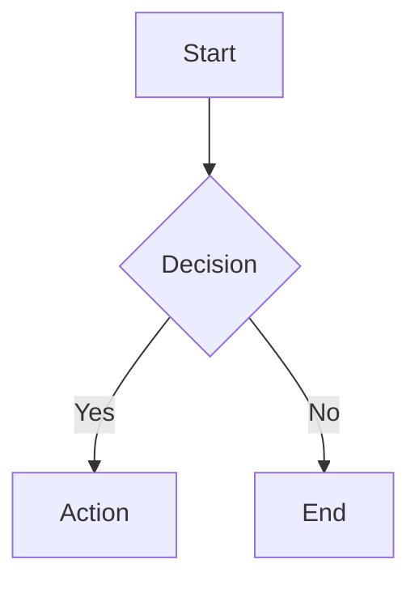
````

The diagram will render automatically in:
- Artifact preview drawer
- Chat interactions
- PDF/DOCX/ODT exports

### Critical Syntax Rules

**Follow these rules to avoid render failures:**

1. **❌ NEVER use parentheses inside square brackets for node labels**
   ```
   BAD:  A[Server (Primary)]
   GOOD: A[Server - Primary]
   GOOD: A[Primary Server]
   ```

2. **❌ NEVER use multi-line text inside node labels**
   ```
   BAD:  A[First Line\nSecond Line]
   GOOD: A[First Line and Second Line]
   GOOD: Split into separate nodes
   ```

3. **❌ NEVER use `<br/>` or `<br>` tags in flowcharts**
   - These don't work reliably in Mermaid flowcharts
   - Use dashes, "and", or split into multiple nodes

4. **⚠️ Escape special characters in labels**
   ```
   AVOID:  A[Cost & Time]
   BETTER: A[Cost and Time]
   WORKS:  A["Cost & Time"]
   ```

5. **✅ Keep node labels simple and descriptive**
   ```
   GOOD: A[User Authentication] --> B[Token Validation]
   ```

### Requesting Diagrams from Agents

Three agents have Mermaid capabilities:
- **Artifact Manager Agent** - Creates diagram artifacts
- **Research Assistant** - Visualizes research findings
- **Research Synthesizer** - Creates synthesis diagrams

Simply ask:
```
"Can you create a flowchart showing the authentication process?"
"Create a sequence diagram for the user registration flow"
"Visualize the database relationships as an ER diagram"
```

The agent will:
1. Design the diagram using Mermaid syntax
2. Call `generate_mermaid_diagram` tool
3. Create an artifact with the rendered diagram
4. Reference it in the response

## Supported Diagram Types

### Flowcharts

Visualize processes, algorithms, and workflows:

````markdown
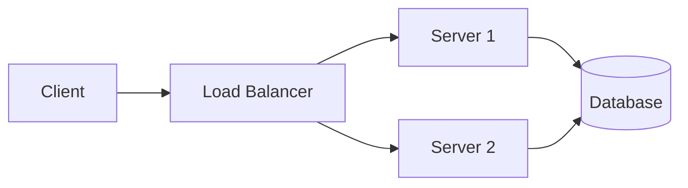
````

**Directions:** `TD` (top-down), `LR` (left-right), `BT` (bottom-top), `RL` (right-left)

**Node Shapes:**
- `[Rectangle]` - Standard box
- `(Rounded)` - Rounded corners
- `{Diamond}` - Decision point
- `[(Database)]` - Cylinder shape
- `([Stadium])` - Pill shape
- `[[Subroutine]]` - Double border

### Sequence Diagrams

Show interactions between actors over time:

````markdown
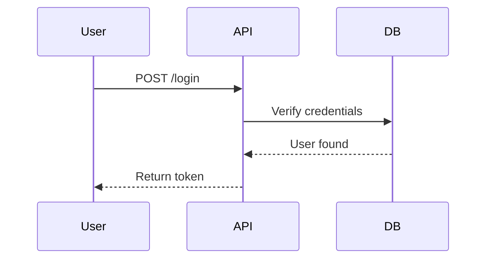
````

**Arrow Types:**
- `->` - Solid line
- `-->` - Dotted line
- `->>` - Solid arrow
- `-->>` - Dotted arrow
- `-x` - Cross at end (async)

### Class Diagrams

Document object-oriented architecture:

````markdown
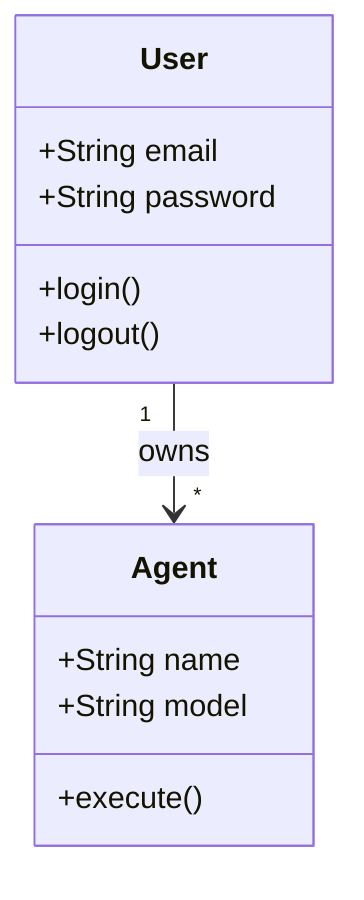
````

**Relationships:**
- `<|--` - Inheritance
- `*--` - Composition
- `o--` - Aggregation
- `-->` - Association
- `--` - Link

### State Diagrams

Model state machines and transitions:

````markdown
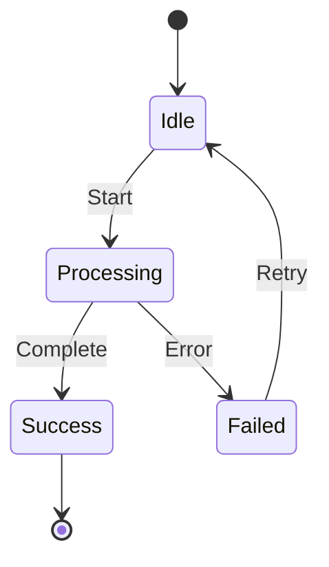
````

### ER Diagrams

Document database relationships:

````markdown
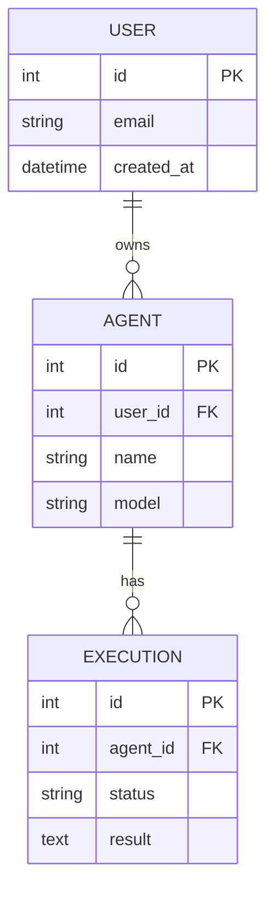
````

**Cardinality:**
- `||` - Exactly one
- `|o` - Zero or one
- `}|` - One or many
- `}o` - Zero or many

### Gantt Charts

Project timelines and schedules:

````markdown
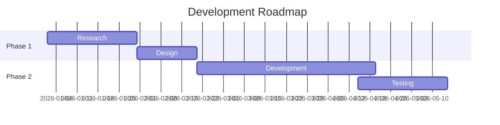
````

### Pie Charts

Data visualization:

````markdown
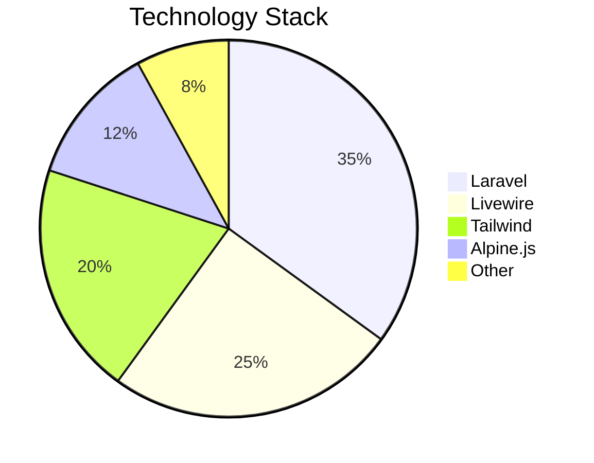
````

## Client-Side Rendering

### Automatic Theming

Diagrams automatically adapt to your theme:

- **Light Mode** - Uses Mermaid's `default` theme (professional colors)
- **Dark Mode** - Uses Mermaid's `dark` theme (optimized for dark backgrounds)
- **Theme Toggle** - Diagrams re-render automatically when you switch themes

### Live Re-Rendering

The system watches for theme changes using a MutationObserver:

```javascript
// When dark mode is toggled
document.documentElement.classList.toggle('dark')
// → All diagrams automatically re-render with new theme
```

Original Mermaid code is preserved in `data-mermaid-code` attributes for re-rendering.

### Horizontal Scrolling

Wide diagrams (like complex flowcharts) enable horizontal scrolling:

```css
pre.mermaid[data-processed="true"] {
    overflow-x: auto;  /* Scroll if diagram is wider than container */
    overflow-y: hidden;
}
```

## Server-Side Rendering (Exports)

### PDF/DOCX/ODT Export

When exporting artifacts to document formats:

1. **Pre-Processing** - All `\`\`\`mermaid` blocks are detected
2. **Rendering** - Each diagram is rendered to PNG via Mermaid-CLI service
3. **Upload** - Images are uploaded to S3 with 2-hour signed URLs
4. **Replacement** - Mermaid blocks replaced with `` references
5. **Conversion** - Modified markdown is sent to Pandoc

**Export Settings:**
- **Format:** PNG (best compatibility across formats)
- **Background:** White (print-friendly)
- **Theme:** Default (professional, non-aggressive colors)
- **Scale:** 4x with smart constraints (high resolution while preventing LaTeX errors)
- **Maximum Width:** 2000px (prevents oversized images that cause PDF conversion failures)

### Example Export Flow

```markdown
Input:
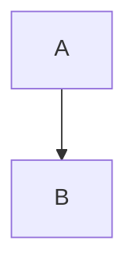

↓ Pre-processing ↓


↓ Pandoc ↓

Final PDF/DOCX/ODT with embedded high-res image
```

## Agent Integration

### Available Agents

Three agents include the `generate_mermaid_diagram` tool:

**Artifact Manager Agent:**
- Primary diagram creation agent
- Supports all diagram types
- Creates artifacts with titles and descriptions

**Research Assistant:**
- Visualizes research findings
- Creates process diagrams
- Documents workflows

**Research Synthesizer:**
- Synthesizes information visually
- Creates relationship diagrams
- Shows connections between concepts

### Tool Definition

```php
Tool::as('generate_mermaid_diagram')
    ->for('Generate diagrams using Mermaid.js syntax')
    ->withStringParameter('code', 'The Mermaid diagram code', true)
    ->withStringParameter('title', 'Title for the diagram artifact', true)
    ->withStringParameter('description', 'Brief description of the diagram')
    ->withStringParameter('format', 'Output format: svg or png (default: svg)')
```

### Syntax Validation

The tool includes **automatic syntax validation** before rendering:

**Validates:**
- No parentheses inside square brackets
- No multi-line text in node labels
- No unescaped special characters

**If validation fails:**
- Agent receives specific error messages
- Includes examples of how to fix
- Agent can retry with corrected syntax

**Benefits:**
- Catches errors before rendering
- Faster feedback loop
- Clear, actionable error messages

### Agent Workflow

1. **User Request:** "Create a flowchart for user authentication"
2. **Agent Analysis:** Determines appropriate diagram type and structure
3. **Code Generation:** Writes valid Mermaid syntax (following critical rules)
4. **Validation:** Tool validates syntax before rendering
5. **Tool Execution:** Calls `generate_mermaid_diagram` with code and title
6. **Artifact Creation:** Tool creates SVG/PNG attachment
7. **Response:** Agent references the diagram in chat

**If validation fails:**
- Agent receives error messages with specific fixes
- Agent corrects syntax and retries
- Process repeats until successful

### System Prompt Extract

Agents receive these instructions:

```markdown
## Mermaid Diagram Generation

You can create diagrams using the `generate_mermaid_diagram` tool. Supports:
- Flowcharts (graph TD/LR)
- Sequence diagrams
- Class diagrams
- State diagrams
- ER diagrams (Entity-Relationship)
- Gantt charts
- Pie charts

**When to Use:**
- User requests visualizations, flowcharts, or diagrams
- Complex data relationships need visual representation
- Process flows or workflows need documentation

**CRITICAL SYNTAX RULES (violations cause render failures):**

1. ❌ NEVER use parentheses () inside square brackets [] for node labels
   - BAD: `A[Server (Primary)]`
   - GOOD: `A[Server - Primary]` or `A[Primary Server]`

2. ❌ NEVER use multi-line text inside node labels (no \n in labels)
   - BAD: `A[First Line\nSecond Line]`
   - GOOD: `A[First Line and Second Line]`

3. ❌ NEVER suggest using `<br/>` or `<br>` tags in flowcharts (they don't work reliably)
   - BAD: `A[Line 1<br/>Line 2]`
   - GOOD: `A[Line 1 and Line 2]` or split into separate nodes

4. ⚠️ Escape special characters in labels or use quotes
   - Avoid: `A[Cost & Time]`
   - Better: `A[Cost and Time]` or `A["Cost & Time"]`

5. ✅ Keep node labels simple and descriptive
   - GOOD: `A[User Authentication] --> B[Token Validation]`

**How to Use:**
1. Design the diagram using valid Mermaid syntax (follow rules above!)
2. Call `generate_mermaid_diagram` with the code, title, and description
3. Tool validates syntax and creates a chat attachment
4. If validation fails, you'll receive specific error messages with fixes
```

## Advanced Examples

### Multi-Level Flowchart

````markdown
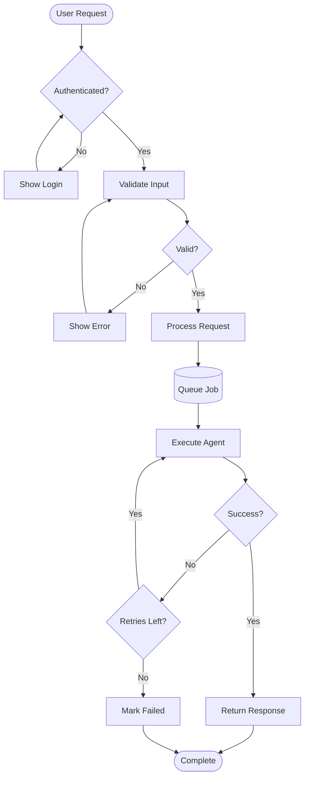
````

### Complex Sequence Diagram

````markdown
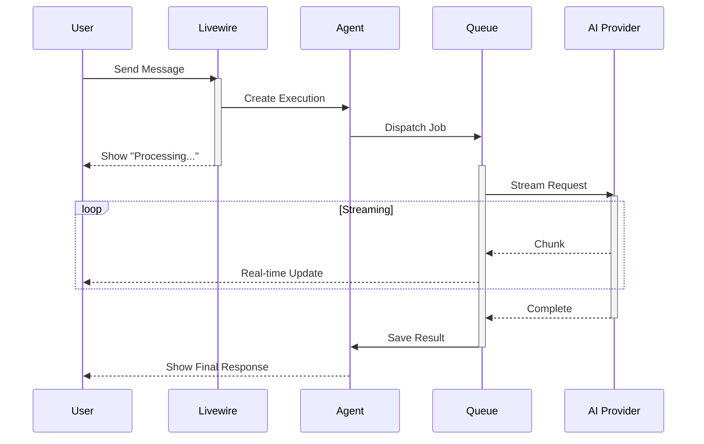
````

### Detailed Class Diagram

````markdown
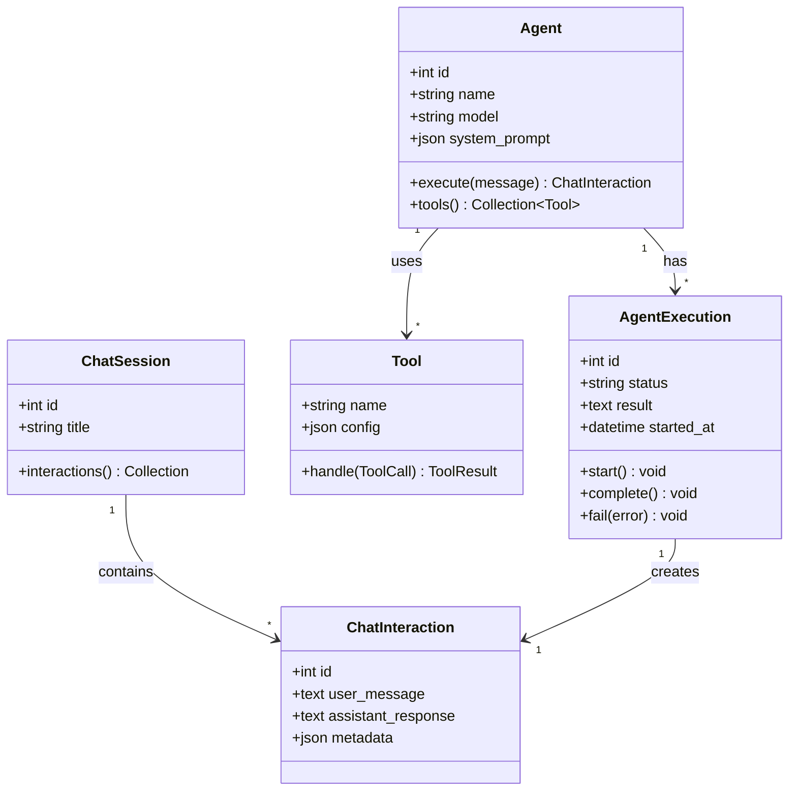
````

### State Machine with Notes

````markdown
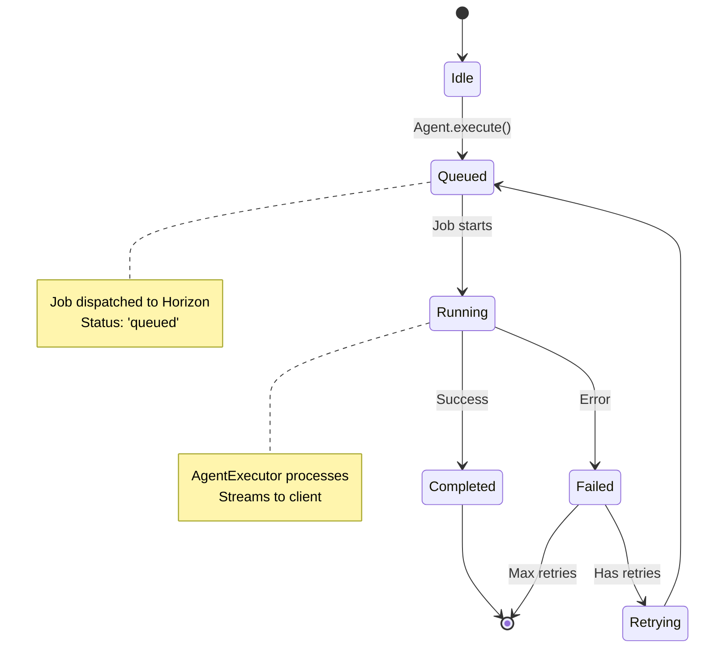
````

### Database ER Diagram

````markdown
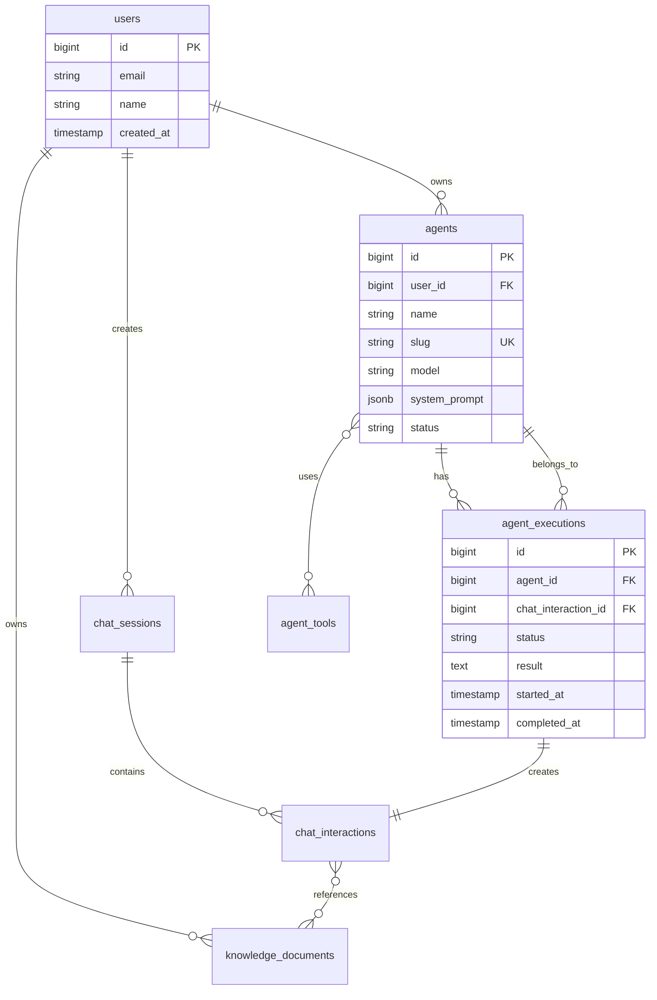
````

### Project Gantt Chart

````markdown
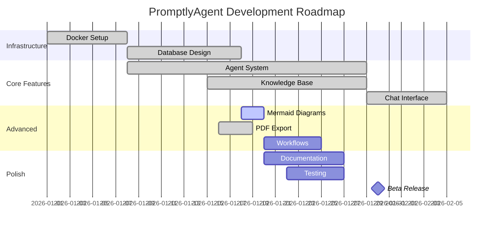
````

## Troubleshooting

### Diagrams Not Rendering in Browser

**Problem:** Mermaid blocks show as plain text instead of diagrams

**Solution:**
- Verify mermaid.js is loaded (check browser console for errors)
- Ensure code block uses triple backticks with `mermaid` language identifier
- Check for syntax errors in your Mermaid code
- Try refreshing the page

### Syntax Errors

**Problem:** "Syntax error in graph" message appears

**Solution:**
- Validate syntax at [mermaid.live](https://mermaid.live)
- Check for common issues:
  - **Parentheses inside square brackets**: `A[Server (Primary)]` → `A[Server - Primary]`
  - **Multi-line labels**: `A[Line 1\nLine 2]` → `A[Line 1 and Line 2]`
  - **`<br/>` tags in flowcharts**: Don't use these - combine text or split into nodes
  - Typos in diagram type (`graph`, `sequenceDiagram`, etc.)
  - Incorrect arrow syntax (`->`, `-->`, `->>`, etc.)
  - Unclosed brackets

### Diagrams Cut Off in Exports

**Problem:** Long diagram titles or labels are truncated in PDFs

**Solution:**
- This is a known limitation of Mermaid-CLI rendering
- Keep titles concise (under 40 characters)
- Use subtitle or description for additional context
- Consider breaking complex diagrams into multiple smaller ones

### PDF Conversion Fails with "Image Conversion Error"

**Problem:** PDF export fails with HTTP 500 error mentioning "Could not convert image" for mermaid diagrams

**Root Cause:**
- LaTeX (used by Pandoc for PDF generation) has maximum image size limits
- Very wide diagrams with 4x scaling can exceed these limits
- Example: A 1425px diagram × 4 scale = 5700px width (too large for LaTeX)

**Solution (Automatic as of 2026-01-18):**
- System now enforces a 2000px maximum width constraint
- Scale factor is automatically reduced if needed to fit within constraints
- Example: 1200px viewport × 4 scale with 2000px max → scale reduced to ~1.6x
- Diagrams still render at high resolution but won't cause conversion failures

**Manual Configuration:**
If you need different constraints, adjust in `.env`:
```bash
MERMAID_MAX_WIDTH_PDF=2000  # Maximum output width in pixels
MERMAID_SCALE_PDF=4         # Desired scale factor (reduced if needed)
```

### Dark Colors in PDF Exports

**Problem:** Diagrams in PDFs use dark theme colors (hard to read on white paper)

**Solution:**
- This should not happen - exports use `default` theme with professional colors
- If you see dark colors, check your Mermaid code for explicit theme or style directives
- Remove any `%%{init: {'theme':'dark'}}%%` directives
- If problem persists, check `app/Services/Pandoc/PandocConversionService.php:169` confirms `'theme' => 'default'`

### Service Unavailable

**Problem:** "Mermaid service unavailable" error

**Solution:**
1. Check service status:
   ```bash
   docker ps | grep mermaid
   ```

2. Verify all containers are running:
   ```bash
   ./vendor/bin/sail ps
   ```

3. Check service health:
   ```bash
   curl http://localhost:3001/health
   ```

4. Restart services if needed:
   ```bash
   ./vendor/bin/sail restart mermaid-1 mermaid-2 mermaid-lb
   ```

5. Check logs for errors:
   ```bash
   docker logs promptlyagent-mermaid-1
   docker logs promptlyagent-mermaid-2
   ```

### Low Resolution in PDFs

**Problem:** Diagrams look blurry or pixelated in exported PDFs

**Solution:**
- This should not happen - scale is set to 4x
- Verify scale setting in `PandocConversionService.php:169`: `'scale' => 4`
- If issue persists, increase scale to 6 or 8 (larger files, longer render time)
- Check S3 for actual image resolution (should be ~2512×1800px for typical diagrams)

## Technical Details

### Architecture

The Mermaid system uses a dual-rendering approach:

**Client-Side (Browser Preview):**
- **Library:** mermaid.js v11 (CDN)
- **Rendering:** SVG via JavaScript
- **Theme:** Dynamic (`default` or `dark` based on user preference)
- **Performance:** Instant, no server load

**Server-Side (PDF Export):**
- **Service:** Mermaid-CLI (@mermaid-js/mermaid-cli)
- **Engine:** Puppeteer + Chromium (headless browser)
- **Load Balancer:** Nginx with 2 Mermaid-CLI workers
- **Output:** PNG images uploaded to S3
- **Resolution:** 4x scale (~2512×1800px typical)

**Validation Layer (Tool):**
- **Pre-flight validation:** Checks syntax before rendering
- **Detects:** Parentheses in brackets, multi-line labels, special characters
- **Response:** Specific error messages with fix examples
- **Retry support:** Agents can correct and resubmit

### Microservice Details

**Docker Compose Structure:**
```yaml
services:
  mermaid-1:            # Worker 1
    build: ./docker/mermaid
    image: mermaid-cli:latest

  mermaid-2:            # Worker 2
    build: ./docker/mermaid
    image: mermaid-cli:latest

  mermaid-lb:           # Load balancer
    image: nginx:alpine
    ports: ["3001:80"]
    depends_on: [mermaid-1, mermaid-2]
```

**Service Endpoint:**
- **URL:** `http://mermaid-lb:80` (internal) or `http://localhost:3001` (external)
- **Health Check:** `GET /health`
- **Render:** `POST /render`

**Render Request:**
```json
{
  "code": "graph TD\n    A --> B",
  "format": "png",
  "backgroundColor": "white",
  "theme": "default",
  "scale": 4,
  "maxWidth": 2000
}
```

**Parameters:**
- `code` (required) - Mermaid diagram code
- `format` (optional) - Output format: svg, png, or pdf (default: svg)
- `backgroundColor` (optional) - Background color (default: transparent)
- `theme` (optional) - Mermaid theme: default, dark, neutral, forest, base
- `scale` (optional) - Scale factor for high-resolution output (default: 1)
- `maxWidth` (optional) - Maximum output width in pixels (scale auto-reduced if exceeded)

**Render Response:**
- **Success:** Binary image data (PNG/SVG/PDF) with appropriate MIME type
- **Error:** `{"error": "Rendering failed", "details": "..."}`

### Configuration

**Laravel Config (`config/services.php`):**
```php
'mermaid' => [
    'url' => env('MERMAID_URL', 'http://mermaid-lb:80'),
    'timeout' => (int) env('MERMAID_TIMEOUT', 60),
    'retry_times' => (int) env('MERMAID_RETRY_TIMES', 2),
    'retry_delay' => (int) env('MERMAID_RETRY_DELAY', 1000),
    'enabled' => (bool) env('MERMAID_ENABLED', true),
    // PDF export constraints to prevent LaTeX image size errors
    'max_width_pdf' => (int) env('MERMAID_MAX_WIDTH_PDF', 2000),
    'scale_pdf' => (int) env('MERMAID_SCALE_PDF', 4),
],
```

**Environment Variables (`.env`):**
```bash
MERMAID_URL=http://mermaid-lb:80
MERMAID_TIMEOUT=60
MERMAID_ENABLED=true
MERMAID_MAX_WIDTH_PDF=2000  # Maximum output width for PDF exports (prevents LaTeX errors)
MERMAID_SCALE_PDF=4         # Scale factor for PDF exports (auto-reduced if exceeds max width)
FORWARD_MERMAID_PORT=3001
```

### Performance Metrics

- **Client-Side Rendering:** <100ms (instant visual feedback)
- **Server-Side Rendering:** 1-3 seconds per diagram (includes upload to S3)
- **Concurrent Requests:** 2 workers handle parallel exports
- **Max Diagram Size:** No hard limit (tested up to 50+ nodes)
- **Memory Usage:** ~150MB per worker (Chromium overhead)

### Database Schema

**Agent Tools:**
```sql
INSERT INTO agent_tools (agent_id, tool_name, tool_config, enabled, execution_order)
VALUES (
    (SELECT id FROM agents WHERE slug = 'artifact-manager-agent'),
    'generate_mermaid_diagram',
    '{}',
    true,
    15
);
```

**Artifact Metadata:**
```json
{
  "mermaid_source": "graph TD\n    A --> B",
  "format": "svg",
  "rendered_at": "2026-01-18T02:37:32Z"
}
```

### Security

**Sandboxing:**
- Mermaid-CLI runs in isolated Docker containers
- No file system access outside `/tmp`
- No network access (except outbound for CDN fonts)
- Puppeteer runs with `--no-sandbox` and `--disable-setuid-sandbox` (required for Docker)

**Input Validation:**
- Mermaid syntax is validated by mermaid-cli parser
- Invalid syntax returns error (no code execution risk)
- Maximum input size: 10MB per diagram
- Timeout: 30 seconds per render (prevents DoS)

**Output Safety:**
- Generated images stored in S3 with signed URLs
- 2-hour expiration on signed URLs (enough for Pandoc conversion)
- Content-Type headers enforced (image/png, image/svg+xml)
- No user-provided filenames (random IDs only)

## Resources

**Official Mermaid Documentation:**
- [Mermaid.js Documentation](https://mermaid.js.org/)
- [Syntax Reference](https://mermaid.js.org/intro/syntax-reference.html)
- [Theming Guide](https://mermaid.js.org/config/theming.html)
- [Live Editor](https://mermaid.live) - Test your diagrams

**Mermaid-CLI:**
- [GitHub - mermaid-js/mermaid-cli](https://github.com/mermaid-js/mermaid-cli)
- [CLI Options](https://github.com/mermaid-js/mermaid-cli#options)

**PromptlyAgent Resources:**
- [PDF Export Documentation](08-pdf-export.md) - Pandoc integration details
- [Architecture](03-architecture.md) - System design overview
- [Workflows](04-workflows.md) - Automating diagram generation

**Diagram Examples:**
- [Flowchart Syntax](https://mermaid.js.org/syntax/flowchart.html)
- [Sequence Diagram Syntax](https://mermaid.js.org/syntax/sequenceDiagram.html)
- [Class Diagram Syntax](https://mermaid.js.org/syntax/classDiagram.html)
- [State Diagram Syntax](https://mermaid.js.org/syntax/stateDiagram.html)
- [ER Diagram Syntax](https://mermaid.js.org/syntax/entityRelationshipDiagram.html)
- [Gantt Chart Syntax](https://mermaid.js.org/syntax/gantt.html)

## Next Steps

- Explore [PDF Export](08-pdf-export.md) to create professional documents with embedded diagrams
- Learn about [Workflows](04-workflows.md) for automated diagram generation
- Review [Package Development](07-package-development.md) for custom diagram integrations
- Check [Architecture](03-architecture.md) to understand the agent system that powers diagram creation
