# PromptlyAgent Screenshots

This directory contains screenshots showcasing the key features and user interface of PromptlyAgent.

## Main Application

### Main Screen

*The main chat interface showing the AI agent interaction area with real-time streaming responses, sidebar navigation, and dark mode support.*

### Real-Time Updates
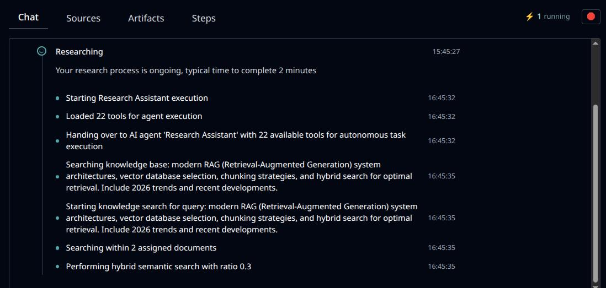
*Live streaming of AI agent responses with real-time progress indicators powered by Laravel Reverb WebSockets.*

### Execution Steps

*Detailed view of agent execution workflow showing all the steps taken during task processing, including tool usage and decision-making.*

### Full Execution Details
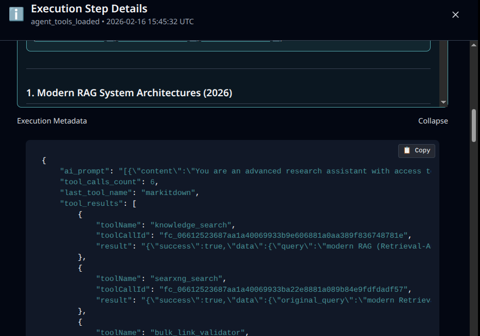
*In-depth breakdown of individual execution steps with complete context, inputs, outputs, and timing information.*

### Sources & Citations
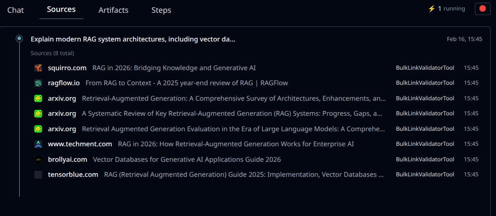
*Display of knowledge sources and citations used by the agent to generate responses, with links to original documents.*

## Agent Management

### Agent Manager
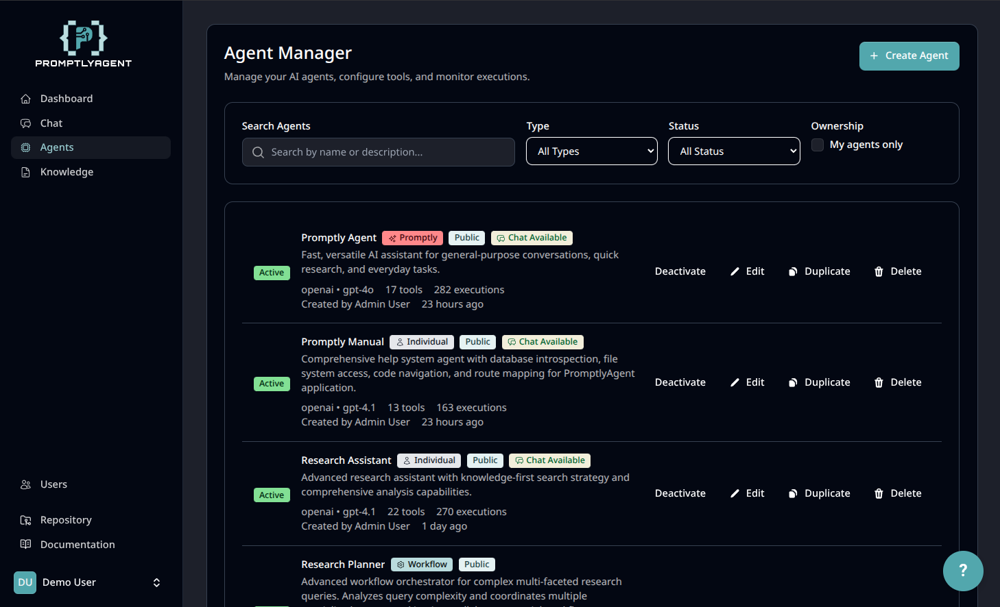
*Agent management interface showing all configured agents with their models, tools, and status. Create, edit, and organize multiple AI agents.*

### Agent Editor
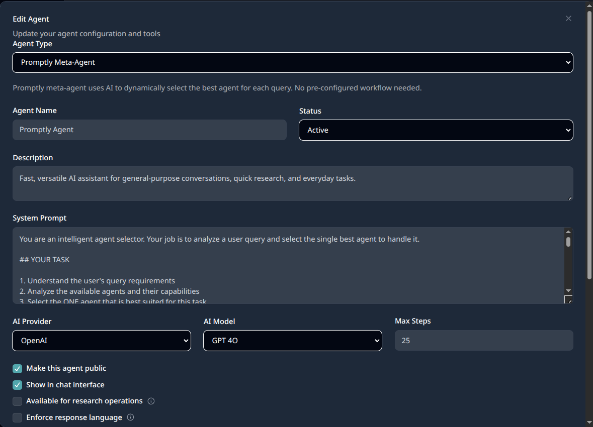
*Comprehensive agent configuration interface for setting up AI models, system prompts, available tools, and knowledge sources.*

## Knowledge System

### Knowledge Manager
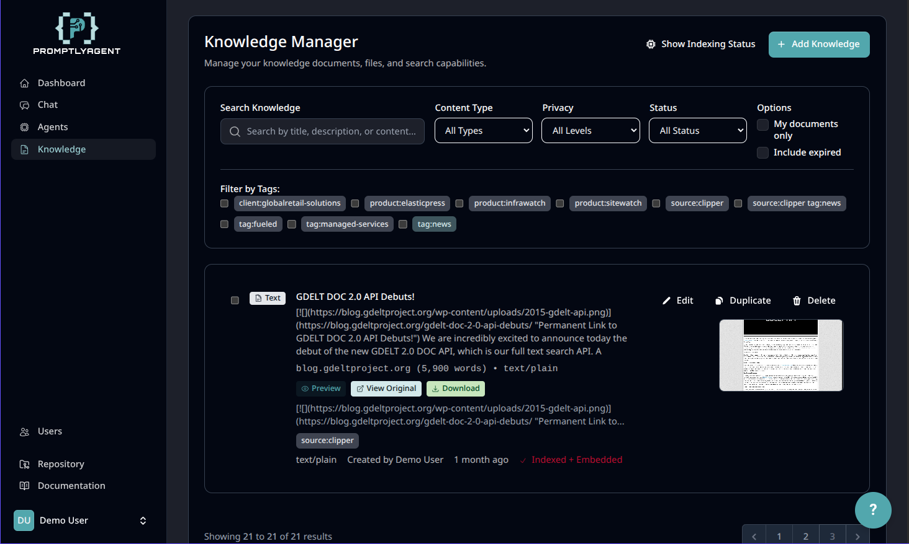
*Knowledge management interface with support for documents, URLs, and automatic refresh scheduling. Features privacy controls and tagging.*

## Artifacts

### Artifact Creation & Version History
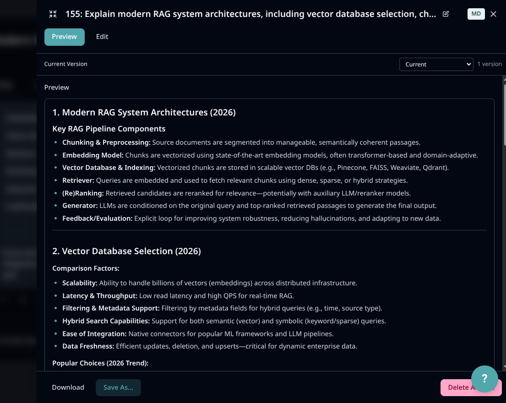
*Create and edit artifacts with full version history tracking. Supports multiple artifact types with collaborative editing.*

### Artifact Exports
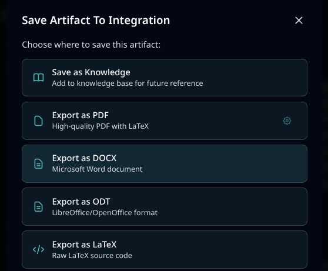
*Export artifacts in various formats with customizable options for sharing and integration.*

## Progressive Web App (PWA)

### PWA Setup
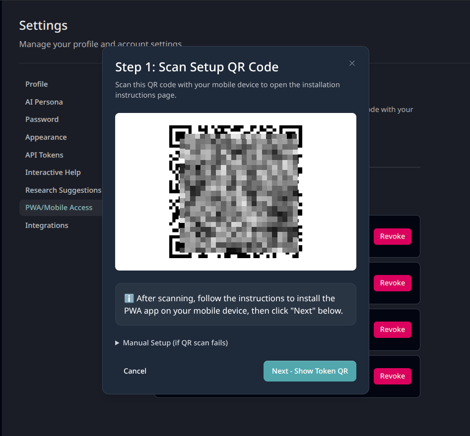
*Progressive Web App installation flow with native-like app experience on mobile and desktop devices.*

### PWA Mobile App
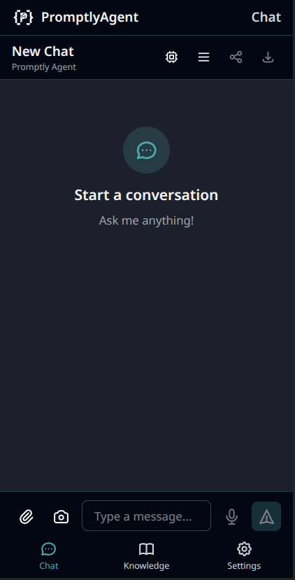
*PromptlyAgent running as an installed PWA on mobile with full offline support and native features.*

## Community

### Community Extensions
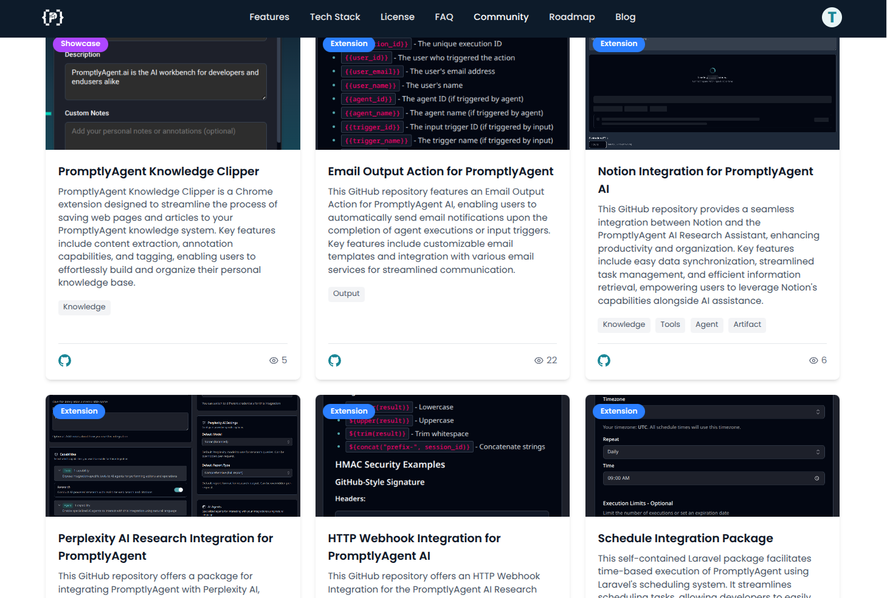
*Browse and discover community-built extensions, integrations, and custom tools from the PromptlyAgent ecosystem.*
Visit [our Website](https://promptlyagent.ai/community) to learn more.

---

**Note**: All screenshots show the dark mode theme. PromptlyAgent fully supports both light and dark modes with seamless switching.
